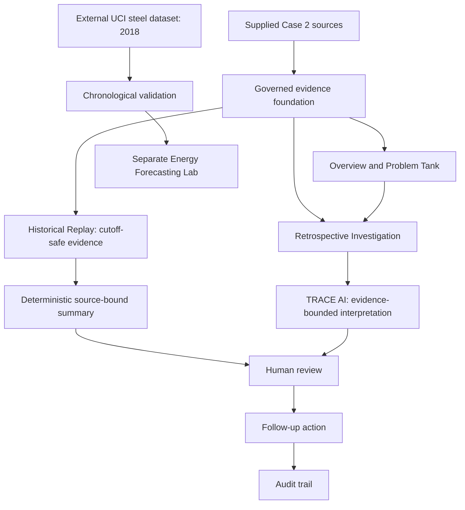
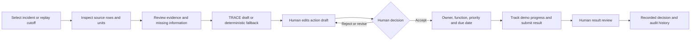

# TRACE-MI · Evidence to human-reviewed action

**Team SYNKARA | CALIBER 2026 · Case 2: Manufacturing Intelligence**

TRACE-MI connects fragmented incident, production, equipment-condition and RCA records into a traceable investigation workflow for asset-intensive chemical manufacturing. Managers can see historical exposure; engineers can inspect the evidence, distinguish what was known before an event from what was learned afterward, and review follow-ups with ownership and an audit trail.

**What makes it different:** source-level provenance, deterministic historical replay, explicit abstention, and human review between an AI draft and a follow-up action.

> **AI may interpret the evidence, but it may never outrank the evidence.**

**[Open the live prototype](https://synkara-trace-mi.vercel.app/)** · [Three-minute evaluation](#recommended-three-minute-evaluation) · [Q1/Q2/Q3](#how-trace-mi-addresses-case-2) · [Evidence boundaries](#evidence-boundaries)

## Live prototype and judge access

**Live prototype:** [synkara-trace-mi.vercel.app](https://synkara-trace-mi.vercel.app/)

**Email:** `judge.synkara2026@example.com`

**Password:** `SYNKARA-JUDGE-2026!`

This is a shared, prototype-only account prepared for CALIBER 2026 evaluation. It is active, has `judge` membership and has no administrator access.

The account can create and review its own demo follow-ups. Demo-generated actions may remain visible until the evaluation environment is reset. Its audit history identifies the shared account, **not an individual judge or independent approver**. View-guide choices change navigation guidance, not permissions. Actions were intentionally cleared before submission.

## Recommended three-minute evaluation

| Time | Open / do | Evidence to inspect |
| --- | --- | --- |
| 0:00–0:25 | **Overview**; inspect scope and filter by plant/date. | Historical exposure, separate actual/potential loss, source links. |
| 0:25–0:45 | **Problem Tank → KO-3201 · 29 Apr 2026**. | The selected ZCU incident and its investigation. |
| 0:45–1:15 | **Historical Replay / Rewind asset observations**; select KO-3201 and **22 Apr 2026**. | Weekly `ALARM`, **71.674 micron** radial vibration and **1,372.791 ppm** oil water; no future incident or RCA conclusion. |
| 1:15–1:40 | Return to retrospective **Investigation**. | **32 h** downtime, **1,584 kUSD actual** and **475.2 kUSD potential** recorded loss; Incident Database row **5**. |
| 1:40–2:10 | Open **TRACE AI → Review as action draft**. | Evidence references, missing information, abstention and a proposed next check. Review before saving. |
| 2:10–2:35 | Open the selected **RCA source**. | Team PDF rendition and extracts for orientation; supplied PowerPoint remains authoritative. |
| 2:35–3:00 | Open **Energy Forecasting Lab**. | External UCI label, four forecast intervals, held-out actual reveal and error distribution. |

For a longer evaluation, save a clearly labelled demo draft, record the human decision, responsible function, priority rationale and due date, then inspect persisted event history. Demo verification records desk review or simulated work, not physical maintenance.

## The problem and supplied evidence coverage

Fragmented dashboards can show a loss, an alarm and an RCA conclusion without explaining whether they concern the same asset, use compatible units, or were available at the same time. TRACE-MI makes these relationships and limits visible before a reviewer chooses a follow-up.

| Supplied Case 2 evidence | Coverage | Boundary |
| --- | --- | --- |
| Incident Database | **380 historical records; 12 plant labels** | Competition sample, not enterprise-wide Chandra Asri operations. |
| Production and Equipment Performance | **5 detailed assets**: PU-2101B, KO-3201, PM-4405B, HE-3301, BL-5702 | 3,600 hourly production rows and 130 weekly condition observations; frequencies and units remain separate. |
| RCA presentations | **5 supplied decks / 55 source slides** | Historical investigation material; missing supplied RCA does not mean no RCA exists elsewhere. |

See the [data dictionary](docs/data_dictionary.md) and [source audit](docs/data_audit.md). Production `OFF` counts do not replace recorded downtime. Actual and potential loss remain distinct. Duplicate AR/MTO labels are not unique incident identifiers.

## How TRACE-MI addresses Case 2

| Requirement | Demonstrated response | Inspectable evidence |
| --- | --- | --- |
| **Q1 — Rationalize fragmented dashboards into a governed foundation** | Source registry, field-to-KPI mapping, definitions, units, dataset boundaries and data issues. | [Data Foundation](src/pages/dashboard/DataFoundationPage.tsx), [dictionary](docs/data_dictionary.md), [audit](docs/data_audit.md). |
| **Q2 — Executive visibility, Energy Forecasting, Similar-Incident Retrieval and AI-based Root Cause Indication** | Overview and Problem Tank lead to investigation; rule-based retrieval explains matching labels; TRACE AI proposes evidence-bound checks; separate Energy Lab demonstrates chronological forecasting. | [Overview](src/pages/dashboard/OverviewPage.tsx), [Investigation/retrieval](src/pages/dashboard/InvestigationPage.tsx), [assistant](api/assistant.js), [forecast evidence](imports/prepared/energy_forecast/forecast_summary.json). |
| **Q3 — Prioritized human-reviewed follow-up with ownership and tracking** | Editable drafts, recorded decisions, responsible function, priority rationale, due date, progress and result review. | [Draft Composer](src/pages/dashboard/actions/DraftComposer.tsx), [Actions](src/pages/dashboard/ActionsPage.tsx), [action service](src/services/actions.ts). |

Root cause **indication** is a review aid: the current assistant abstains from certifying a cause. Similarity uses explainable component/type/mechanism matching, not learned failure prediction; a broad equipment-type match alone is weak context.

## Product architecture



The UCI branch stays separate from Case 2 losses and chemical-plant measurements. The foundation governs the supplied sample; enterprise historian and plant-control integrations are not implemented.

## Evidence-to-action workflow



Source references and the selected evidence snapshot accompany the follow-up. Shared-account ownership demonstrates persistence; operational accountability would require named users and independent approval roles.

## KO-3201: observation is not hindsight

On **22 April 2026**, Equipment `Condition History` row **21** records `ALARM`, radial vibration **71.674 micron**, and oil water **1,372.791 ppm**. Replay treats a date-only weekly observation as available at the end of that date under a documented team assumption. Hourly Production measurements remain separate: `MM/S` and `micron` are not interchangeable.

On **29 April 2026**, Incident Database row **5** records the ZCU event with **32 h downtime**, **1,584 kUSD actual loss** and **475.2 kUSD potential loss**. These are **historical recorded exposures, not TRACE-MI savings or demonstrated avoidable losses**.

Retrospective investigation allows human inspection of RCA2. It does not make that conclusion knowable on 22 April. Conflicting sensor narratives and thresholds retain their own provenance rather than being merged into a fabricated trend. See the [source audit](docs/data_audit.md) and [acceptance scenarios](docs/demo_scenarios.md).

## Responsible AI and human oversight

| Control | Current implementation and limit |
| --- | --- |
| **Evidence bounded** | The server constructs a scoped evidence packet and sanitizes output against allowed evidence IDs. Generated wording remains a draft requiring source verification. |
| **Temporal integrity** | Replay retrieves cutoff-bounded evidence and always uses its deterministic summary. Future incidents, RCA conclusions and full-period summaries are excluded. |
| **Human-in-the-loop** | AI may prefill a draft; a person reviews the evidence and chooses whether to save, accept, revise or reject it. |
| **Abstention / CAUSE UNDETERMINED** | The current assistant excludes RCA slide conclusions from provider input and enforces abstention. Human RCA inspection is separate. |
| **Provenance** | File, sheet, row, column or slide references support review. A sample row does not prove an aggregate KPI. |
| **Provider fallback** | Retrospective mode uses server-side Fireworks when configured. Provider failure/unavailability returns a labelled deterministic source-bound summary. Replay does not call the provider. |
| **No autonomous plant-control write-back** | Follow-ups are prototype records, with no autonomous maintenance execution or plant-control connection. |

Implementation: [assistant API](api/assistant.js), [Investigation](src/pages/dashboard/InvestigationPage.tsx), [action review](src/pages/dashboard/actions/ActionDetail.tsx). These controls reduce unsupported interpretation; they do not guarantee every generated statement is correct.

## Evidence boundaries

- Historical records and replay demonstrate investigation, **not real-time monitoring or proven failure prediction**.
- Five team-prepared RCA renditions were visually reviewed in Chrome for judge readability. The supplied presentations remain the source authority. This review does not certify a physical root cause or automatically promote historical RCA source actions into TRACE-MI follow-ups. Structured RCA review flags remain separate from the completed PDF readability review.
- The 380 incidents, 12 plant labels and five detailed assets describe the **competition sample**, not all company assets or operations.
- Energy Lab uses **external UCI steel-industry data from South Korea, 2018**. It is not Chandra Asri energy forecasting, measured company energy savings or a facility bill.
- A verified demo action records a workflow decision, not physical maintenance, avoided loss or independent engineer sign-off.
- This competition prototype is not claimed to be bug-free, enterprise-certified or production-ready for Chandra Asri.

## Business impact and proposed pilot metrics

The proposed value is faster evidence retrieval, fewer source/unit/time misunderstandings and clearer follow-up accountability. Benefits have **not** been measured. Historical loss provides investigation context, not a benefit estimate.

| Proposed pilot measure | Evaluation method |
| --- | --- |
| Evidence retrieval time | Compare the same manual and TRACE-MI tasks; record time, sample size and errors. |
| Evidence fidelity | Check cited values, units, dates and rows/slides against originals; count unsupported statements. |
| Temporal integrity and abstention | Test pre-event cutoffs and cases without supplied RCA; record leakage and inappropriate certainty. |
| Follow-up completeness | Measure drafts with rationale, owner/function, priority, due date, evidence and checkable result. |
| Forecast quality | Report held-out errors against simple baselines, including tail errors, for the external dataset only. |

**Chemical-domain relevance:** reliability review combines condition, process and incident evidence while preserving measurement semantics and engineering authority. TRACE-MI demonstrates this review pattern without claiming a validated chemical-process model.

**Proposed roadmap:** agree pilot tasks, source access and success thresholds; validate asset identities, time availability, units and ownership with engineers; introduce named accounts and independent approval; then evaluate read-only historian/CMMS integration, security, performance and operational acceptance. These are future stages, not delivered integrations.

## Energy Forecasting Lab — external validation only

The lab uses **35,040 UCI readings**, chronological train-reference/validation/test segments and four forecast intervals. It selects between **last observation** and **same time previous day** on validation error: a transparent baseline experiment, not a trained industrial AI forecasting system.

The committed [forecast summary](imports/prepared/energy_forecast/forecast_summary.json) selects last observation and records **5,277 test cutoffs / 21,108 interval predictions**:

| Held-out measure | Recorded result |
| --- | --- |
| MAE per interval, across four horizons | **8.34096 kWh** |
| Mean absolute error of the four-interval total | **30.715914 kWh** |
| 95th percentile absolute error of the four-interval total | **156.916 kWh** |

Test windows overlap. Interval semantics and midnight timestamp handling require documented assumptions. Small example errors do not represent the whole distribution. Historical US$ cost illustrations use cited 2018 Korean price/exchange-rate benchmarks; forecast error is not a saving. See [forecast logic](scripts/forecast_energy.py) and [benchmark attribution](src/services/energyBenchmark.ts).

## Technical architecture and feasibility

**React 19, TypeScript 6 and Vite 8** power the interface; Supabase provides authentication/Postgres with membership and row-level controls; Python scripts prepare sources; a Node `/api/assistant` handler runs on Vercel. Vite development mounts the same handler locally. The lockfile pins installed dependency versions.

The browser uses a publishable client key; AI credentials stay server-side. Source evidence, deterministic calculations and human decisions remain useful when the provider is unavailable. Migrations document the schema but must not be blindly replayed against an existing project. See the dated [deployment notes](docs/DEPLOYMENT_READINESS.md).

## Verification status

**Verification baseline: submission candidate reviewed 1 October 2026.** Code checks, earlier project verification and historical audits have different scopes:

| Check | Evidence / scope |
| --- | --- |
| Python importer syntax; Node assistant syntax; TypeScript typecheck; production Vite build | **PASS**, rechecked locally on 1 October 2026. These checks do not validate a deployed database. |
| Historical Replay regression | **PASS** on the submission candidate; current code gates provider calls to retrospective mode. Dataset acceptance checks require separately supplied prepared files. |
| Live retrospective AI and source-bound fallback | Tested on the submission candidate; provider behavior depends on server-side configuration. |
| Five RCA renditions visually reviewed | Reviewed in Chrome for judge readability; supplied PPTs remain authoritative, while structured RCA review and promotion remain separate from PDF readability review. |
| Production Vercel deployment and judge login | Tested on the submission candidate; this does not establish enterprise production readiness. |

[Gate 6](docs/GATE6_VERIFICATION.md), [Gate 7](docs/GATE7_VERIFICATION.md) and [Gate 8](docs/GATE8_FINAL_REPORT.md) are **historical audits**. Their earlier provider and RCA review statuses are dated snapshots. Build success does not establish live Auth/RLS, provider availability or maintenance execution.

## Repository guide

| Path | Purpose |
| --- | --- |
| `src/pages/dashboard/` | Overview, foundation, investigation, AI, actions and Energy Lab. |
| `src/pages/data/` | Source-record views. |
| `src/services/` | Client configuration, action access and benchmark attribution. |
| `api/assistant.js` | Authenticated evidence assembly, provider handling and abstention. |
| `scripts/` | Preparation, validation, import tooling and energy backtest. |
| `supabase/migrations/` | Database definitions, not instructions to modify a live database. |
| `public/rca/` | Team-prepared RCA renditions. |
| `docs/` | Definitions, source audit, demo scenarios and historical verification. |
| `imports/prepared/energy_forecast/forecast_summary.json` | Committed aggregate forecast evidence. |

Raw files and most prepared datasets are intentionally excluded from Git. A fresh clone builds the frontend but cannot fully reproduce source validation or imported data without the separately supplied files.

## Local setup

1. Use **Node.js 24+** and run `npm ci`.
2. Copy `.env.example` to `.env.local` as UTF-8. Set `VITE_PUBLIC_SUPABASE_URL` and `VITE_PUBLIC_SUPABASE_PUBLISHABLE_KEY` for an authorized evaluation/development project. Never put a database password, service-role key or AI key in a `VITE_PUBLIC_` variable.
3. Run `npm run check:config`, then `npm run dev`. Use an existing active account for that target. Configuration validation checks format, not live permissions or schema compatibility.
4. For generated retrospective drafts, set `TRACE_AI_PROVIDER=fireworks`, `FIREWORKS_API_KEY` and `FIREWORKS_MODEL` server-side, then restart Vite. Without a working provider, the source-bound fallback remains available. `npm run preview` previews the frontend; it does not serve the local assistant API.
5. Run code checks below. Python source-validation scripts additionally require the authorized prepared datasets, which are not included in the public clone.

```sh
npm run typecheck
npm run build
node --check api/assistant.js
python -m py_compile scripts/import_to_supabase.py
# Only when required prepared datasets are available:
python scripts/validate_data.py
python scripts/verify_prototype.py
```

**Do not modify the Golden Supabase baseline.** Running the frontend does not require applying migrations or executing an importer. For a separate development environment, first reconcile its schema, policies, data and migration ledger with the [deployment notes](docs/DEPLOYMENT_READINESS.md). Never commit `.env.local`, database secrets, service-role credentials or AI-provider keys. The public judge credential above is intentionally limited to this shared competition prototype.

## Team SYNKARA

| Member | Program | Cohort |
| --- | --- | --- |
| Muhamad Noval Darmawan | Telecommunication Systems | 2025 |
| Aprila Rayna Syakira | Accounting | 2024 |
| Ilyasa | Mechatronics & Artificial Intelligence | 2025 |

**Universitas Pendidikan Indonesia**

## Competition and source attribution

The Q1/Q2/Q3 mapping and evaluation dimensions follow the CALIBER 2026 Case 2 materials supplied to participants. The official Case Book and Registration Booklet remain the authority if any repository wording differs.

| Evaluation dimension | Where to assess it |
| --- | --- |
| Problem Understanding & Business Impact | Problem, sample coverage, historical exposure and proposed pilot metrics. |
| Solution Design & Prototype Quality | Live walkthrough, foundation, replay and action review. |
| Presentation Quality (Technical) | Diagrams, source links and reproducible code checks. |
| Feasibility & Roadmap | Implemented stack, deployment boundaries and staged pilot plan. |
| Chemical Domain Relevance | Asset-specific evidence, measurement integrity and engineering review. |

Case 2 workbooks, RCA PowerPoints and the dataset-explanation presentation are supplied competition material. Team renditions, normalized records and generated summaries do not replace the originals. The external UCI steel dataset is attributed in the [data dictionary](docs/data_dictionary.md); monetary benchmark sources are recorded in the [energy benchmark module](src/services/energyBenchmark.ts). Source references do not assert ownership or redistribution rights over supplied material.
